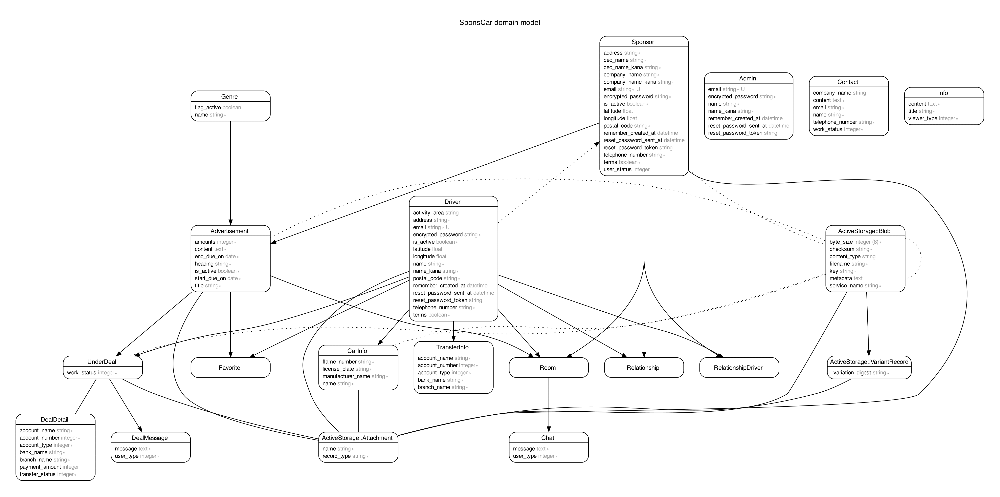

# README

## 開発言語
* Ruby 3.0.1
* Ruby on Rails 6.1.6

## 就業Termの技術
* devise
* お気に入り機能（Ajaxによる非同期通信）
* フォロー機能 (Ajaxによる非同期通信)
* AWS EC2へのデプロイ

## カリキュラム外の技術
* 地図表示機能（Google Map API）
* Active Storage

## 実行手順
```
$ https://github.com/yasuo-masuyama/SponsCar.git
$ cd SponsCar
$ bundle
$ yarn
$ rails db:create
$ rails db:migrate
$ rails db:seed
$ rails s
```
## カタログ設計・テーブル設計
https://docs.google.com/spreadsheets/d/1m4Y8Vv_pEBZE8l1sofptIowc5ldCFYp7hrSFwubHU6s/edit?usp=sharing

## ワイヤーフレーム
https://cacoo.com/diagrams/xDgSzMB6Nu9BdHyR/DCD65

## ER図



## 画面遷移図


## インフラ構成図

